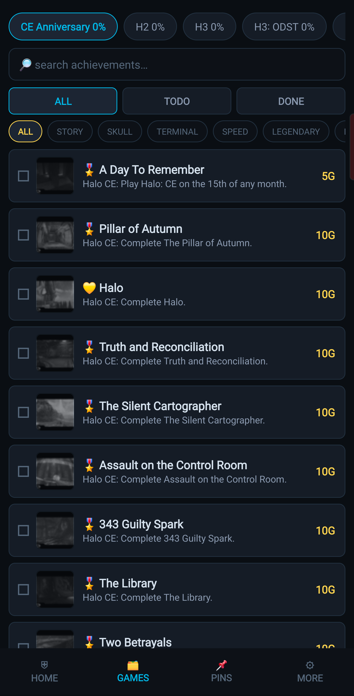
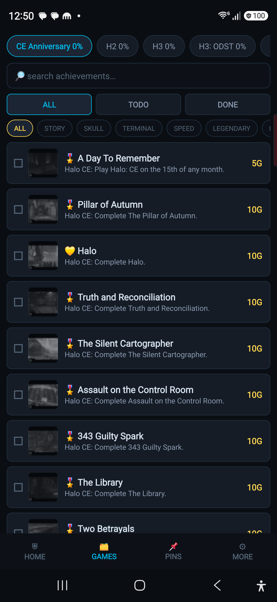

# 🛡️ UNSC TERMINAL
### Halo MCC 100% Achievement Tracker

*Every achievement. Every game. One terminal.*

 

&nbsp;&nbsp;

---

**UNSC Terminal** is a native Android tracker for 100%ing *Halo: The Master Chief Collection*. Full achievement database imported from Halopedia, real achievement art (greyed while locked, full color when unlocked), per-achievement guides, and Xbox Live sync.

> 🎖️ *Design inspired by the old **Halo Waypoint** app* — the companion that tracked your career, service record, and challenges. This is a love-letter to that experience, reimagined as a completionist's tracker.

🌐 **Web version:** [floorloops.github.io/halo-mcc-tracker](https://floorloops.github.io/halo-mcc-tracker/) · 📱 **Android:** grab the APK from [Releases](../../releases)

## ✨ Features

- 🗂️ **690 achievements / 7,110G** across CE Anniversary, Halo 2 + H2A MP, Halo 3, ODST, Reach, Halo 4, and MCC General
- 🖼️ **Real achievement art** — official icons load live with disk caching; locked = greyscale, unlocked = full color
- ⚡ **Xbox Live sync** — paste a free [OpenXBL](https://xbl.io) key → SYNC NOW pulls your true unlock state
- 📖 **GUIDES button on every achievement** — jump to its Halopedia page, TrueAchievements guide, or YouTube solutions
- 🎖️ **UNSC rank ladder** — Recruit → Master Chief as your completion climbs
- 📌 **Pins** · 🔎 **search** · 🏷️ **type filters** (story / skull / terminal / speed / LASO / legendary…) · ✅ ALL/TODO/DONE
- 🏆 **100 in-app achievements** with animated unlock banners, sounds, and an app-rank that climbs as you earn them — plus hidden secrets to discover
- ⏱️ **Session timer** with check-off counter
- 💾 **Offline-first** — progress stored locally, one-tap clipboard backup, zero accounts, zero telemetry

## 📦 Get it

| Channel | What you get |
|---|---|
| [**Releases**](../../releases) | `UNSCTerminal-v1.1.apk` — native Android app (sideload) |
| [**Web**](https://floorloops.github.io/halo-mcc-tracker/) | Browser version — desktop-friendly, same database lineage |
| `src/` | Full source — single-file Java, zero dependencies, no-Gradle build |

## 🗺️ Roadmap

| Phase | Focus | Status |
|---|---|---|
| **v1.0** | Native app · 690-achievement database · real icons · Xbox Live sync · guide links | ✅ shipped |
| **v1.1** | Icons fill their frame (crop-to-fit) · full UNSC rank ladder · estimated time-to-100% · per-type stats | ✅ shipped |
| **v1.1.1** | **100 in-app achievements** (icons · animated unlock banners · sounds · app-rank) + hidden easter eggs + Halo Waypoint-inspired credit | ✅ shipped |
| **v1.1.2** | In-app roadmap · Xbox sync no longer storms 100 unlock banners · 101 achievements with how-to-unlock descriptions + a "find all secrets" meta-achievement | ✅ shipped |
| **v1.1.3** | "What's New" update-review screen (new content reconciles silently, then a single summary) · Grunt API key field (get ahead of v1.3 career stats) | ✅ shipped |
| **v1.1.x** | Exact-700 reconciliation vs TrueAchievements (dedupe the 690→700) · **smart weighted time-to-completion** (difficulty-aware — a LASO playlist is 20+ hrs, not 1; weight by type/skull-stacking/legendary, not a flat per-achievement guess) | 🔜 next |
| **v1.2** | **Overhauled ranking** (XP-weighted — harder achievements earn more experience, not flat %) · Halo 3 rank icons · **smart breakdowns & focus mode**: categorize by easter egg / vehicle-focus / long vs short mission · show every achievement within a mission · mission-map view · *"what can I knock out in this exact mission/mode right now?"* | planned |
| **v1.2.5** | **Native UI glow-up** — bring the native app up to the web version's look (UNSC HUD styling, glows, depth, polish) | planned |
| **v1.3** | **Career stats** — medals, headshots, kills, accuracy, playtime pulled from Xbox/Halo stats API · per-game Halo icons · game-asset backgrounds + overall design pass | planned |
| **v1.3.5** | **Achievement artwork viewer** — tap to view the full high-res achievement art (requires scraping + bundling HQ image sets) | planned |
| **v1.3.1** | Optimization & tweaks — full review pass, fix small issues + anything that slipped through | planned |
| **v1.4** | Halo SFX (mutable) · animations & transitions | planned |
| **v1.5** | Packaged notification sound · minor tweaks | planned |
| **v1.6** | Home-screen widgets | planned |
| **v1.7** | General tips & pointers blended from YouTube / Halopedia / TrueAchievements | planned |
| **v1.8** | Per-achievement written walkthroughs · solution videos · path/collectible screenshots | planned |
| **v1.9** | Optimal completion-order engine + least-pain LASO routing | planned |
| **v2.0** | Generic **"100% Checklist"** edition for Google Play (original branding & assets) | planned |

## 🏗️ Building

No Gradle, no Android Studio: `aapt2 → ecj → d8 → zipalign → apksigner`. The entire app is one Java file + one JSON database.

## ⚖️ Disclaimer

Unofficial fan-made tool, free, for personal use. *Halo* and *The Master Chief Collection* are trademarks of Microsoft Corporation / Halo Studios (343 Industries); achievement names, descriptions, and artwork remain Microsoft's property (icons served from [Halopedia](https://www.halopedia.org)'s gallery). This project is not affiliated with or endorsed by Microsoft. Any commercially distributed version will use original generic branding and assets only.

## 📜 License

Code © 2026 Parliament Four. All rights reserved.

---

<i>"Were it so easy."</i>

